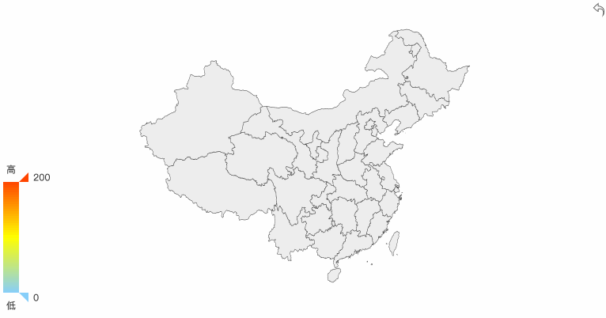

# React Echarts Map China

[](https://github.com/zongzi531/react-echarts-map-china/blob/master/LICENSE)
[](https://travis-ci.org/zongzi531/react-echarts-map-china)
[](https://codecov.io/gh/zongzi531/react-echarts-map-china)

> A China Map Shuttle Component Based on Echarts



## Install

```bash
yarn add react-echarts-map-china

## 静态数据版本安装
yarn add react-echarts-map-china@0.1.7
```

## API

| 参数 | 说明 | 类型 | 默认值 |
| ------ | ------ | ------ | ------ |
| option | [Echarts Option](https://echarts.baidu.com/option.html) | `object` | - |
| loadData | 填充自己所需要的数据 | `function` | - |
| getWarnMessage | 获得⚠️警告提示 | `Function(message)` | - |
| backBtnKey | 返回按钮默认键，为防止覆盖，可自定义修改 | `string` | `'my__back__btn__'` |
| backBtnText | 返回按钮文本 | `string` | `'返回'` |
| backBtnIcon | 返回按钮 Icon | `string` | `'path:// ...'` |
| value | 用于更新 series data 数据 | `any[]` | - |
| equalValue | 用于对比 value 值，返回 `true` 则直接调用 `setSeries` 方法 | `Function(prevValue, value)` | - |
| getData | 获得已被 Cache 的 series data 数据 | `Function(data)` | - |

## Methods

| 名称 | 描述 |
| ------ | ------ |
| setSeries(value) | 通过 `ref` 获取，调用 `ref.setSeries` 即可，传入 `value` 为需更新的 series data 数据。（功能同 `value` API 和 `equalValue` API） |
